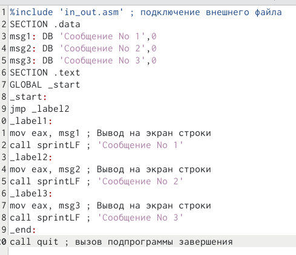
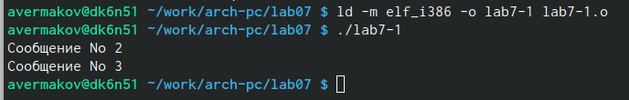
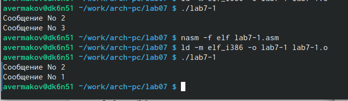
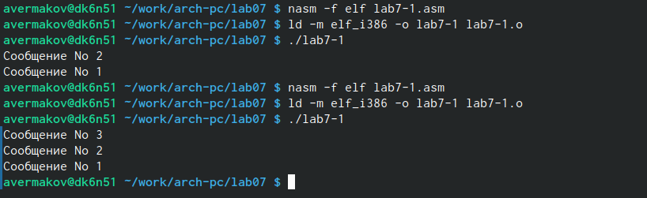
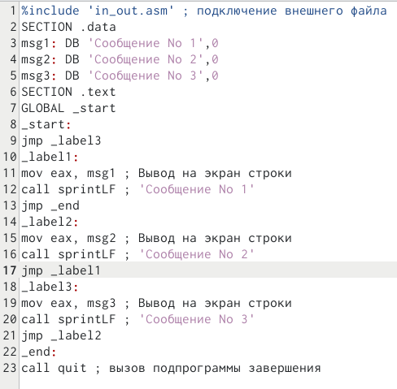
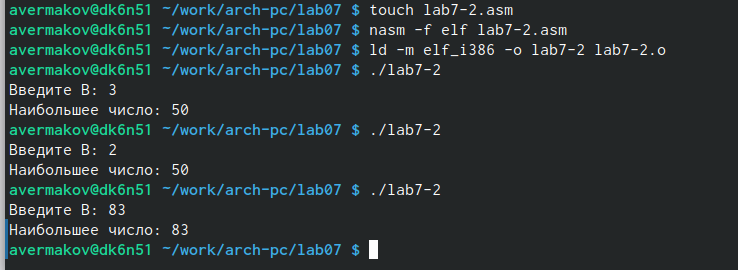
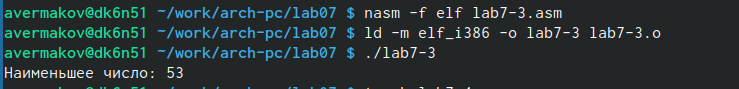
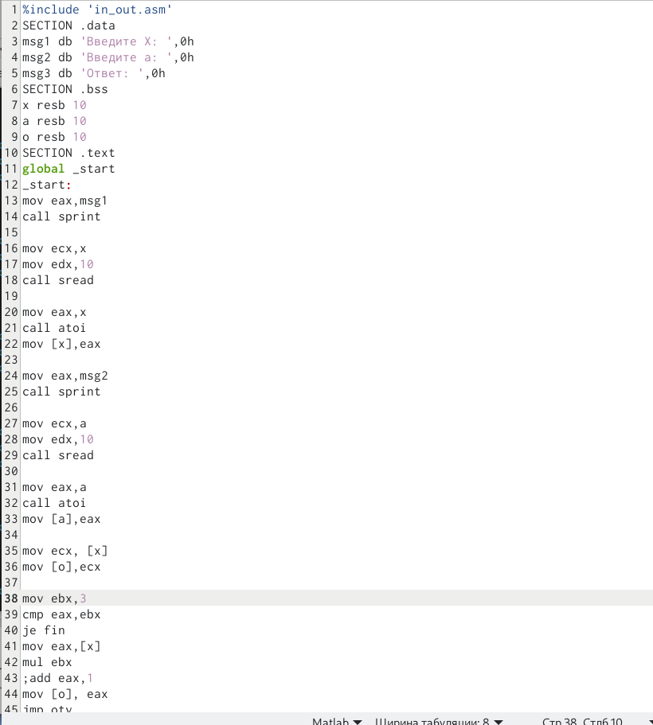
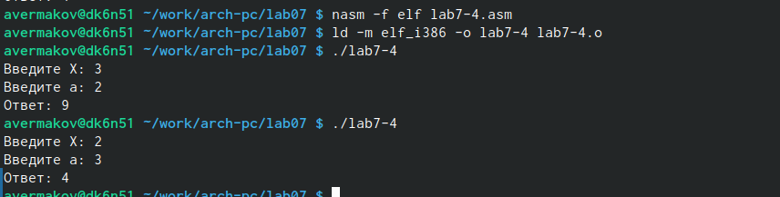

---
## Front matter
title: "Лабораторная работа No7. Команды безусловного и условного переходов в Nasm. Программирование ветвлений."
subtitle: "НПМбв-01-21"
author: "Ермаков Алексей"

## Generic otions
lang: ru-RU
toc-title: "Содержание"

## Bibliography
bibliography: bib/cite.bib
csl: pandoc/csl/gost-r-7-0-5-2008-numeric.csl

## Pdf output format
toc: true # Table of contents
toc-depth: 2
lof: true # List of figures
lot: true # List of tables
fontsize: 12pt
linestretch: 1.5
papersize: a4
documentclass: scrreprt
## I18n polyglossia
polyglossia-lang:
  name: russian
  options:
	- spelling=modern
	- babelshorthands=true
polyglossia-otherlangs:
  name: english
## I18n babel
babel-lang: russian
babel-otherlangs: english
## Fonts
mainfont: PT Serif
romanfont: PT Serif
sansfont: PT Sans
monofont: PT Mono
mainfontoptions: Ligatures=TeX
romanfontoptions: Ligatures=TeX
sansfontoptions: Ligatures=TeX,Scale=MatchLowercase
monofontoptions: Scale=MatchLowercase,Scale=0.9
## Biblatex
biblatex: true
biblio-style: "gost-numeric"
biblatexoptions:
  - parentracker=true
  - backend=biber
  - hyperref=auto
  - language=auto
  - autolang=other*
  - citestyle=gost-numeric
## Pandoc-crossref LaTeX customization
figureTitle: "Рис."
tableTitle: "Таблица"
listingTitle: "Листинг"
lofTitle: "Список иллюстраций"
lotTitle: "Список таблиц"
lolTitle: "Листинги"
## Misc options
indent: true
header-includes:
  - \usepackage{indentfirst}
  - \usepackage{float} # keep figures where there are in the text
  - \floatplacement{figure}{H} # keep figures where there are in the text
---

# Цель работы

Освоить команды условного и безусловного переходов. Получить навыки написания
программ с использованием переходов. 

# Задание

1. Напишите программу нахождения наименьшей из 3 целочисленных переменных a,b и .
Значения переменных выбрать из табл. 7.5 в соответствии с вариантом, полученным
при выполнении лабораторной работы No 6. Создайте исполняемый файл и проверьте
его работу.
2. Напишите программу, которая для введенных с клавиатуры значений x и a вычисляет
значение заданной функции f(x) и выводит результат вычислений. Вид функции f(x)
выбрать из таблицы 7.6 вариантов заданий в соответствии с вариантом, полученным
при выполнении лабораторной работы No 6. Создайте исполняемый файл и проверьте
его работу для значений x и a из 7.6

# Выполнение лабораторной работы

Создал каталог для программам лабораторной работы No 7, перешёл в него и создал файл lab7-1.asm и поместил в него пример программы с использованием инструкции jmp. (рис. @fig:001).

{#fig:001 width=70%}

Создал исполняемый файл и получил результат работы данной программы (рис. @fig:002).

{#fig:002 width=70%}

 Изменил текст программы в соответствии с листингом и получил другой вывод(рис. @fig:003).

{#fig:003 width=70%}

Измените текст программы добавив или изменив инструкции jmp, чтобы вывод программы был 3,2,1(рис. @fig:004).

{#fig:004 width=70%}

Листинг измененной программы для требуемого вывода 3,2,1(рис. @fig:005).

{#fig:005 width=70%}

Программа, которая определяет и выводит на экран наибольшую из 3 целочисленных переменных: A,B и C при различных  значений B. (рис. @fig:006).

{#fig:006 width=70%}

Создал программу нахождения наименьшей из 3 целочисленных переменных a,b и с.(рис. @fig:007).

{#fig:007 width=70%}

Написал программу, которая для введенных с клавиатуры значений 𝑥 и 𝑎 вычисляет
значение заданной функции 𝑓(𝑥) и выводит результат вычислений. (рис. @fig:008).

{#fig:008 width=70%}

Создал исполняемый файл и проверил его работу для значений 𝑥 и 𝑎 из 7.6.(рис. @fig:009).

{#fig:009 width=70%}

# Выводы

В ходе работы были освоены команды условного и безусловного переходов. Получены навыки написания программ математических вычислений с использованием переходов.
# Список литературы{.unnumbered}

