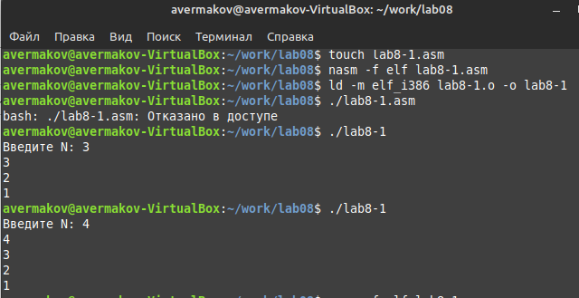
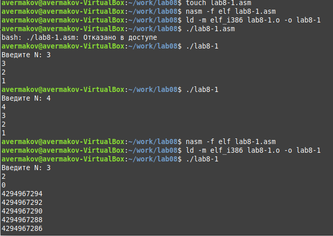
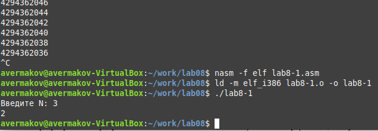
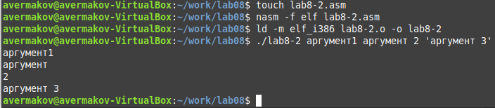
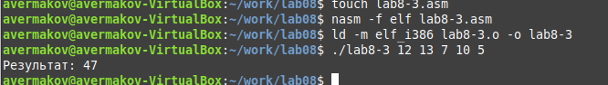
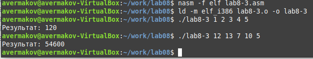
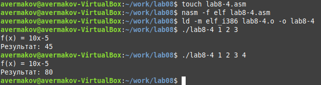

---
## Front matter
title: "Лабораторная работа №8. Программирование цикла. Обработка аргументов командной строки."
subtitle: "НПМбв-01-21"
author: "Ермаков Алексей"

## Generic otions
lang: ru-RU
toc-title: "Содержание"

## Bibliography
bibliography: bib/cite.bib
csl: pandoc/csl/gost-r-7-0-5-2008-numeric.csl

## Pdf output format
toc: true # Table of contents
toc-depth: 2
lof: true # List of figures
lot: true # List of tables
fontsize: 12pt
linestretch: 1.5
papersize: a4
documentclass: scrreprt
## I18n polyglossia
polyglossia-lang:
  name: russian
  options:
	- spelling=modern
	- babelshorthands=true
polyglossia-otherlangs:
  name: english
## I18n babel
babel-lang: russian
babel-otherlangs: english
## Fonts
mainfont: PT Serif
romanfont: PT Serif
sansfont: PT Sans
monofont: PT Mono
mainfontoptions: Ligatures=TeX
romanfontoptions: Ligatures=TeX
sansfontoptions: Ligatures=TeX,Scale=MatchLowercase
monofontoptions: Scale=MatchLowercase,Scale=0.9
## Biblatex
biblatex: true
biblio-style: "gost-numeric"
biblatexoptions:
  - parentracker=true
  - backend=biber
  - hyperref=auto
  - language=auto
  - autolang=other*
  - citestyle=gost-numeric
## Pandoc-crossref LaTeX customization
figureTitle: "Рис."
tableTitle: "Таблица"
listingTitle: "Листинг"
lofTitle: "Список иллюстраций"
lotTitle: "Список таблиц"
lolTitle: "Листинги"
## Misc options
indent: true
header-includes:
  - \usepackage{indentfirst}
  - \usepackage{float} # keep figures where there are in the text
  - \floatplacement{figure}{H} # keep figures where there are in the text
---

# Цель работы

Приобрести навыки написания программ с использованием циклов и обработкой
аргументов командной строки.

# Задание

Напишите программу, которая находит сумму значений функции f(x) для
x = x1, x2, ..., xn, т.е. программа должна выводить значение f(x1) + f(x2) + ... + f(xn).
Значения xi передаются как аргументы. Вид функции f(x) выбрать из таблицы
8.1 вариантов заданий в соответствии с вариантом, полученным при выполнении
лабораторной работы № 7. Создайте исполняемый файл и проверьте его работу на
нескольких наборах 

# Теоретическое введение

Стек — это структура данных, организованная по принципу LIFO («Last In — First Out»
или «последним пришёл — первым ушёл»). Стек является частью архитектуры процессора и
реализован на аппаратном уровне. Для работы со стеком в процессоре есть специальные
регистры (ss, bp, sp) и команды.
Основной функцией стека является функция сохранения адресов возврата и передачи
аргументов при вызове процедур. Кроме того, в нём выделяется память для локальных
переменных и могут временно храниться значения регистров.

Стек имеет вершину, адрес последнего добавленного элемента, который хранится в ре-
гистре esp (указатель стека). Противоположный конец стека называется дном. Значение,
помещённое в стек последним, извлекается первым. При помещении значения в стек указа-
тель стека уменьшается, а при извлечении — увеличивается.

# Выполнение лабораторной работы

Создал каталог для программам лабораторной работы, написал в файл lab8-1.asm текст программы из листинга 8.1. Создал исполняемый файл
и проверил его работу. (рис. @fig:001).

{#fig:001 width=70%}

Изменил текст программы добавив изменение значения регистра ecx в цикле (рис. @fig:002).

{#fig:002 width=70%}

Внес изменения в текст программы добавив команды push и pop (добавления в стек и извлечения из стека) для сохранения значения счетчика цикла loop. Создал исполняемый файл и проверил его работу. (рис. @fig:003).

{#fig:003 width=70%}

Создал исполняемый файл и запустил его, указав аргументы:  аргумент1 аргумент 2 'аргумент 3'. В данном случае было обработано 4 аргумента, так как часть строки "аргумент 2" разделена пробелом и не имеет '' данных символов, а значит воспринимается как два разных аргумента (рис. @fig:004).

{#fig:004 width=70%}

Создал исполняемый файл и запустил его, указав аргументы 12 13 7 10 5 (рис. @fig:005).

{#fig:005 width=70%}

Изменил текст программы для вычисления произведения аргументов командной строки. Создал исполняемый файл и запустил его, указав разные аргументы. (рис. @fig:006).

{#fig:006 width=70%}

Написал программу, которая находит сумму значений функции f(x) для x = x1, x2, ..., xn, т.е. программа должна выводить значение f(x1) + f(x2)+...+f(xn) (f(x) = 10x-5) (рис. @fig:007).

{#fig:007 width=70%}

# Выводы

Были получены навыки написания программ с использованием циклов и обработкой аргументов командной строки

