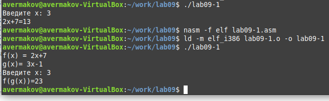

---
## Front matter
title: "Лабораторная работа №9. Понятие подпрограммы. Отладчик GDB."
subtitle: "НПМбв-01-21"
author: "Ермаков Алексей"

## Generic otions
lang: ru-RU
toc-title: "Содержание"

## Bibliography
bibliography: bib/cite.bib
csl: pandoc/csl/gost-r-7-0-5-2008-numeric.csl

## Pdf output format
toc: true # Table of contents
toc-depth: 2
lof: true # List of figures
lot: true # List of tables
fontsize: 12pt
linestretch: 1.5
papersize: a4
documentclass: scrreprt
## I18n polyglossia
polyglossia-lang:
  name: russian
  options:
	- spelling=modern
	- babelshorthands=true
polyglossia-otherlangs:
  name: english
## I18n babel
babel-lang: russian
babel-otherlangs: english
## Fonts
mainfont: PT Serif
romanfont: PT Serif
sansfont: PT Sans
monofont: PT Mono
mainfontoptions: Ligatures=TeX
romanfontoptions: Ligatures=TeX
sansfontoptions: Ligatures=TeX,Scale=MatchLowercase
monofontoptions: Scale=MatchLowercase,Scale=0.9
## Biblatex
biblatex: true
biblio-style: "gost-numeric"
biblatexoptions:
  - parentracker=true
  - backend=biber
  - hyperref=auto
  - language=auto
  - autolang=other*
  - citestyle=gost-numeric
## Pandoc-crossref LaTeX customization
figureTitle: "Рис."
tableTitle: "Таблица"
listingTitle: "Листинг"
lofTitle: "Список иллюстраций"
lotTitle: "Список таблиц"
lolTitle: "Листинги"
## Misc options
indent: true
header-includes:
  - \usepackage{indentfirst}
  - \usepackage{float} # keep figures where there are in the text
  - \floatplacement{figure}{H} # keep figures where there are in the text
---

# Цель работы

Получить навыки написания программ с использованием подпрограмм. Познакомиться
с методами отладки при помощи GDB и его основными возможностями.

# Задание

1. Преобразуйте программу из лабораторной работы №8 (Задание №1 для самостоятель-
ной работы), реализовав вычисление значения функции  как подпрограмму.
2. В листинге 9.3 приведена программа вычисления выражения. При запуске
данная программа дает неверный результат. Проверьте это. С помощью отладчика GDB,
анализируя изменения значений регистров, определите ошибку и исправьте ее

# Выполнение лабораторной работы

Создал каталог для программам лабораторной работы, написал в файл lab09-1.asm текст программы из листинга 9.1. Создал исполняемый файл и проверил его работу. (рис. @fig:001).

{#fig:001 width=70%}

Изменил текст программы добавив добавив две подпрограммы вычисления арифметического выражения. Создал исполняемый файл и проверил его работу(рис. @fig:002).

{#fig:002 width=70%}

Создал файл lab09-2.asm с текстом программы из Листинга 9.2. (Программа печати сообщения Hello world!) и проверил его работу. Начал отладку(рис. @fig:003).

{#fig:003 width=70%}

Проверил работу программы, запустив ее в оболочке GDB с помощью команды run. (рис. @fig:004).

{#fig:004 width=70%}

В режиме псевдографики gdb была установлена точка останова по адресу инструкции. (рис. @fig:005).

{#fig:005 width=70%}

Посмотрели значение переменной по адресу используя отображения содержимого памяти. Посмотрели инструкцию mov ecx,msg2 которая записывает в регистр ecx адрес перемененной msg2 (рис. @fig:006).

{#fig:006 width=70%}

Посмотр позиции стека. Размер переменной - четыре байта и шаг изменения адреса равен размеру переменной (рис. @fig:007).

{#fig:007 width=70%}

Преобразовали программу из лабораторной работы №8 (Задание №1 для самостоятельной работы), реализовав вычисление значения функции  как подпрограмму. (рис. @fig:008).

{#fig:008 width=70%}

Создали файл вычисления арифметического выражения, проверили его работу, обратили внимание на ошибку и запустили отладку. (рис. @fig:009).

{#fig:009 width=70%}

С помощью отладчика GDB, анализируя изменения значений регистров,определил ошибку и исправил(рис. @fig:0010).

{#fig:0010 width=70%}

Создал исполняемый исправленный файл, проверил его работу и убедился, что работает скрипт корректно. (рис. @fig:0011).

{#fig:0011 width=70%}

# Выводы

Приобретение навыков написания программ с использованием подпрограмм. Знакомство с методами отладки при помощи GDB и его основными возможностями прошло успешно

