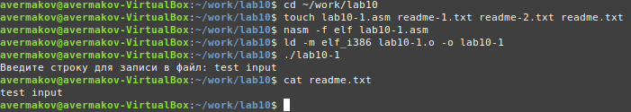
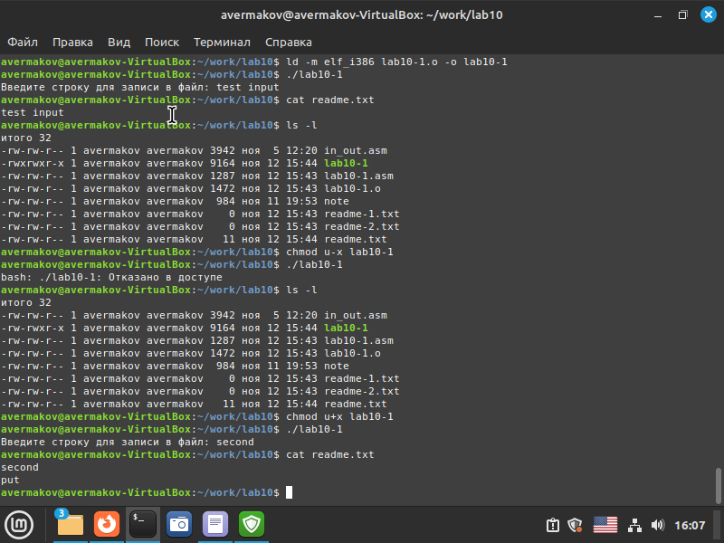
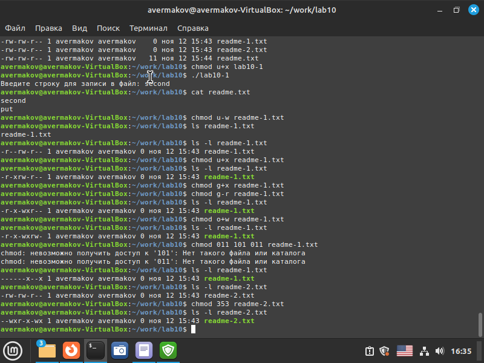
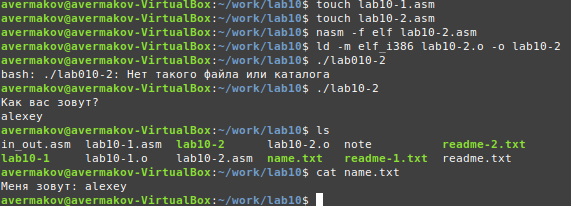

---
## Front matter
title: "Лабораторная работа №10. Работа с файлами средствами Nasm"
subtitle: "НПМбв-01-21"
author: "Ермаков Алексей"

## Generic otions
lang: ru-RU
toc-title: "Содержание"

## Bibliography
bibliography: bib/cite.bib
csl: pandoc/csl/gost-r-7-0-5-2008-numeric.csl

## Pdf output format
toc: true # Table of contents
toc-depth: 2
lof: true # List of figures
lot: true # List of tables
fontsize: 12pt
linestretch: 1.5
papersize: a4
documentclass: scrreprt
## I18n polyglossia
polyglossia-lang:
  name: russian
  options:
	- spelling=modern
	- babelshorthands=true
polyglossia-otherlangs:
  name: english
## I18n babel
babel-lang: russian
babel-otherlangs: english
## Fonts
mainfont: PT Serif
romanfont: PT Serif
sansfont: PT Sans
monofont: PT Mono
mainfontoptions: Ligatures=TeX
romanfontoptions: Ligatures=TeX
sansfontoptions: Ligatures=TeX,Scale=MatchLowercase
monofontoptions: Scale=MatchLowercase,Scale=0.9
## Biblatex
biblatex: true
biblio-style: "gost-numeric"
biblatexoptions:
  - parentracker=true
  - backend=biber
  - hyperref=auto
  - language=auto
  - autolang=other*
  - citestyle=gost-numeric
## Pandoc-crossref LaTeX customization
figureTitle: "Рис."
tableTitle: "Таблица"
listingTitle: "Листинг"
lofTitle: "Список иллюстраций"
lotTitle: "Список таблиц"
lolTitle: "Листинги"
## Misc options
indent: true
header-includes:
  - \usepackage{indentfirst}
  - \usepackage{float} # keep figures where there are in the text
  - \floatplacement{figure}{H} # keep figures where there are in the text
---

# Цель работы

Приобрести навыки написания программ для работы с разрешениями файлов

# Задание

1. Напишите программу работающую по следующему алгоритму:
• Вывод приглашения “Как Вас зовут?”
• ввести с клавиатуры свои фамилию и имя
• создать файл с именем name.txt
• записать в файл сообщение “Меня зовут”
• дописать в файл строку введенную с клавиатуры
• закрыть файл

Создать исполняемый файл и проверить его работу. Проверить наличие файла и его
содержимое с помощью команд ls и cat.

# Выполнение лабораторной работы

Создали каталог для программам лабораторной работы № 10, перешли в него и создали файлы lab10-1.asm, readme-1.txt и readme-2.txt. Введли в файл lab10-1.asm текст программы из листинга 10.1 (Программа записи в
файл сообщения). Создали исполняемый файл и проверили его работу.(рис. @fig:001).

{#fig:001 width=70%}

С помощью команды chmod изменили права доступа к исполняемому файлу lab10-1, запретив его выполнение. Попытались выполнить файл.При попытке выполнить программу на экран выводится сообщение, что нам отказано в доступе. так получается, потому что с помощью сочетания a-x мы отказали в праве на исполнение файла всем пользователям. С помощью команды chmod изменяю права доступа к файлу. Файл  исполняется. Так происходит, потому что, в отличии от прошлой команды мы используем сочетание a+x, где "+" добавляет набор необходимых прав, в нашем случае, это как раньше права на исполнения, а также для всех пользователей (рис. @fig:002).

{#fig:002 width=70%}

Предоставляю права доступа к файлам в соответствии с вариантом в таблице (у меня третий вариант)в символьном, двочном и восьмеричном виде. Проверяю правильность выполнения с помощью команды ls -l(рис. @fig:003).

{#fig:003 width=70%}

Написал программу работающую по следующему алгоритму:

• Вывод приглашения “Как Вас зовут?”

• ввести с клавиатуры свои фамилию и имя

• создать файл с именем name.txt

• записать в файл сообщение “Меня зовут”

• дописать в файл строку введенную с клавиатуры

• закрыть файл 

Создал исполняемый файл и проверил его работу. Проверил наличие файла и его
содержимое с помощью команд ls и cat. (рис. @fig:004).

{#fig:004 width=70%}

# Выводы

Были получены навыки написания программ для работы с разрешениями файлов

